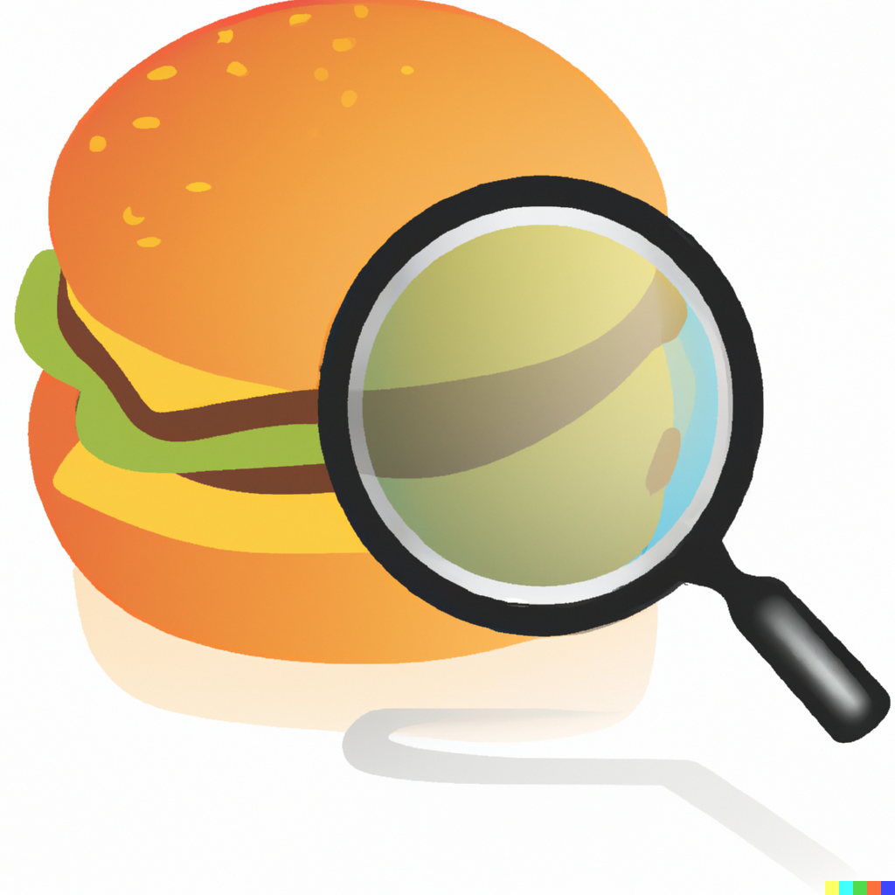

# NutritionKit

This library provides useful functionality for food and nutrition apps in SwiftUI, including:

- Integration with the *OpenFoodFacts* database
- Barcode scanning
- Nutrition label scanning
- Nutrition label rendering

#

## OpenFoodFacts Integration

To lookup a food item from the OpenFoodFacts database, you can use the `OpenFoodFactsAPI` class.

```swift
import NutritionKit

let api = OpenFoodFactsAPI.shared
let foodItem = try await api.find("59032823")

print(foodItem.productName) // Prints "Nutella - 630g"
```

To configure the fields you are interested in, you can use the `configure` function:

```swift
api.configure(productFields: [.productName, .servingSize])
```

#

## Barcode Scanning

NutritionKit provides a SwiftUI view for scanning generic barcodes, `BarcodeScannerView`. To use this view, you must set the value `Privacy - Camera Usage Description` in your app's `Info.plist`.

By itself `BarcodeScannerView` only shows the live camera feed with no overlay or other info. You can provide more information yourself by embedding it in a `ZStack` or in another view.

```swift
import NutritionKit

struct ContentView: View {
    @State var barcodeData: Barcode? = nil

    var body: some View {
        BarcodeScannerView(barcodeData: $barcodeData)
            .onChange(of: barcodeData) { data in
                // A barcode was detected in the camera feed
            }
    }
}
```

## Nutrition Label Scanning

NutritionKit can detect and parse nutrition labels. Currently, only English and German labels are supported. Nutrition labels are scanned similarly to barcodes with the `NutritionLabelScannerView`.

```swift
import NutritionKit

struct ContentView: View {
    @State var nutritionLabel: NutritionLabel? = nil

    var body: some View {
        NutritionLabelScannerView(nutritionLabel: $nutritionLabel)
            .onChange(of: nutritionLabel) { data in
                // A nutrition label was detected in the camera feed
            }
    }
}
```

Currently, the following information can be detected:

- Serving size
- Calories, calories from fat
- Fat, saturated fat, unsaturated fat, trans fat, omega-3 fatty acids
- Carbohyrates, sugar, added sugar, starch, sugar alcohols, dietary fiber
- Protein
- Salt, Sodium, Cholesterol
- Vitamins A, B1, B2, B6, B9, B12, C, DE, E, K
- Caffeine, Taurine, Alcohol
- Magnesium, Calcium, Zinc, Potassium, Iron, Fluoride, Copper, Chloride, Phosphorus, Iodine, Chromium 